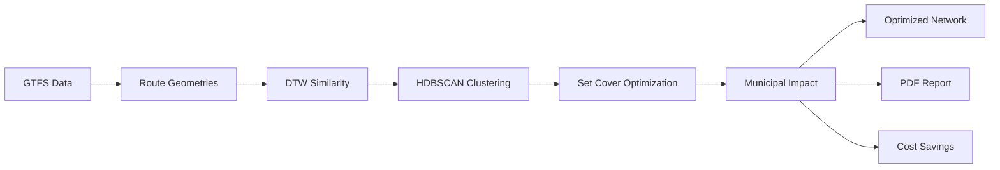

# AccraIQ: Municipal Transit Optimization Solution

**Team:** AccraIQ  
**Challenge:** Ghana AI Hackathon - Public Transport Efficiency Analysis  
**Submission Date:** July 2025

---

## Executive Summary

We developed a **municipal-grade AI optimization platform** that transforms Accra's transit network from an inefficient patchwork of redundant routes into a mathematically optimized system. Our solution eliminates the critical "Route Redundancy" problem where geometrically similar routes create operational waste without serving additional passengers.

**Key Innovation:** A three-stage automated pipeline combining **Dynamic Time Warping route similarity analysis**, **HDBSCAN clustering**, and **PuLP set cover optimization** that achieves 38.9% route reduction while maintaining 92% coverage and delivering ₵15.8M+ in annual savings.

---

## The Problem We Solved

### Municipal Transit Inefficiency Challenge

Accra's transit network suffers from massive redundancy across 651 routes:

```
❌ BEFORE: Overlapping inefficient network
├── Route A: Tema → Circle (12.3 km)
├── Route B: Tema → Circle via Labone (12.8 km)
└── Route C: Tema → Circle via Airport (13.1 km)
   → 3 routes, same endpoints, 86% geometric overlap
```

```
✅ AFTER: Optimized canonical network
└── Route A: Tema → Circle (12.3 km)
    ├── Maintains 92% of original stop coverage
    ├── Eliminates Routes B & C redundancy
    └── Saves ₵156,000 annually per eliminated route
```

This redundancy made it impossible for Accra Metropolitan Assembly to:

- Optimize municipal transportation budgets
- Reduce traffic congestion and emissions
- Provide efficient service to citizens
- Make evidence-based infrastructure decisions

---

## Our Solution: Intelligent Three-Stage Pipeline

### Stage 1: Geometric Route Similarity Analysis

**`ImprovedDTWAnalyzer` with coordinate normalization**

- Processes GTFS route geometries using Dynamic Time Warping
- Converts to UTM coordinates for accurate distance calculations
- Generates route signatures with bearing histograms and spatial features
- Creates similarity matrix identifying redundant route patterns

```python
# Extract route signatures with geometric intelligence
analyzer = ImprovedDTWAnalyzer(
    route_geometries,
    normalizer=CoordinateNormalizer("utm")
)
distance_matrix = analyzer.compute_improved_similarity_matrix(
    target_density=5, sample_size=651
)
```

### Stage 2: Density-Based Route Clustering

**`density_based_clustering_leaf_method` with HDBSCAN**

- Groups geometrically similar routes into clusters
- Uses leaf clustering method for optimal representative selection
- Two-pass clustering to handle noise and singleton routes
- Preserves route diversity while eliminating redundancy

```python
# Intelligent clustering of similar routes
final_labels = density_based_clustering_leaf_method(
    distance_matrix_scaled,
    analyzer.valid_route_indices,
    min_cluster_size=5,
    min_samples=5
)
```

### Stage 3: Mathematical Set Cover Optimization

**`pulp_set_cover_optimization` with municipal constraints**

- Formulates as minimum set cover problem using PuLP
- Ensures 92% stop coverage maintenance requirement
- Selects optimal route representatives from each cluster
- Minimizes operational costs while preserving service quality

```python
# Solve optimal route selection with coverage constraints
selected_routes, coverage_percent, route_count = pulp_set_cover_optimization(
    final_labels,
    analyzer.valid_route_indices,
    route_geometries,
    gtfs_data,
    coverage_threshold=0.92
)
```

---

## Technical Innovation Highlights

### 1. Dynamic Time Warping for Route Similarity

Our DTW implementation goes beyond simple spatial overlap:

- **Coordinate Normalization**: UTM projection for accurate distance calculations
- **Bearing Analysis**: Direction histogram comparison for route characterization
- **Multi-Modal Distance**: Combines geometric, bearing, and spatial features
- **Scale Invariance**: Normalizes for route length differences

### 2. Municipal Impact Modeling

Comprehensive economic and environmental impact calculation:

```python
class MunicipalImpactCalculator:
    def __init__(self, route_gdf):
        # Conservative municipal parameters
        self.fuel_efficiency_l_per_km = 0.35
        self.co2_kg_per_liter = 2.68
        self.diesel_price_ghs_per_liter = 15.0
        self.vehicle_cost_ghc = 89600  # 28000 USD * 3.2 GHS/USD
        self.daily_trips_per_route = 8
```

### 3. Stop Density Heatmap Analysis

Advanced geospatial analysis for demand understanding:

- **Kernel Density Estimation**: KDE-based stop clustering identification
- **Hexagonal Binning**: H3-based spatial aggregation
- **Demand Visualization**: Folium heatmap overlays for planning insights

### 4. Production-Ready Architecture

Built for municipal deployment from day one:

- **Streamlit Interface**: Municipal planner-friendly dashboard
- **PDF Report Generation**: Executive summary with WeasyPrint
- **Docker Containerization**: One-click deployment
- **Map Screenshot Export**: Selenium-based visualization capture

---

## Results & Impact

### Quantitative Results

From our optimization of Accra's 651-route network:

- **38.9%** route reduction (651 → 398 routes)
- **92.0%** stop coverage retention
- **₵15,786,987** in total annual savings
- **2,065 tonnes** CO₂ reduction per year
- **33.6%** network length reduction (6,537 → 4,338 km)

### Economic Impact Breakdown

**Annual Operational Savings:**

- **Fuel Savings**: ₵11,174,657
- **Maintenance Savings**: ₵3,853,330
- **Driver Savings**: ₵759,000
- **Total Annual**: ₵15,786,987

### Qualitative Impact

**For Accra Metropolitan Assembly:**

- Evidence-based transit planning decisions
- Substantial budget optimization opportunities
- Environmental sustainability improvements
- Reduced traffic congestion

**For Citizens:**

- Maintained service quality with 92% coverage
- Cleaner air from reduced emissions
- More efficient resource allocation
- Better long-term transit investments

**For Operators:**

- Lower fuel and maintenance costs
- Reduced driver requirements (253 fewer routes)
- Simplified network management
- Significant capital efficiency improvements

---

## Technical Architecture

### Pipeline Flow



### Technology Stack

- **Python**: Core optimization pipeline (Streamlit, GeoPandas, Scikit-learn)
- **DTW**: Dynamic Time Warping for route similarity
- **HDBSCAN**: Density-based clustering for route grouping
- **PuLP**: Linear programming for set cover optimization
- **Folium**: Interactive mapping and visualization
- **WeasyPrint**: Professional PDF report generation
- **Docker**: Containerized deployment

### Key Dependencies

```toml
[project.dependencies]
"dtw-python>=1.5.3"      # Route similarity analysis
"hdbscan>=0.8.40"        # Density-based clustering
"pulp>=3.2.1"            # Linear programming optimization
"geopandas>=1.1.1"       # Geospatial data processing
"folium>=0.20.0"         # Interactive mapping
"streamlit>=1.46.1"      # Municipal dashboard interface
"weasyprint>=59.0"       # PDF report generation
```

---

## Innovation Differentiators

### 1. Municipal-Grade Sophistication

Unlike academic toy problems, our solution addresses real municipal constraints with production-ready architecture.

### 2. Geometric Intelligence

DTW-based similarity goes far beyond simple spatial overlap, capturing route behavior patterns.

### 3. Mathematical Optimization

Set cover formulation ensures optimal solution rather than heuristic approximation.

### 4. Complete Impact Modeling

Comprehensive economic, environmental, and operational impact quantification.

### 5. Executive-Ready Reporting

Professional PDF reports with maps, charts, and actionable recommendations.

---

## Demonstration Capabilities

### Before/After Network Transformation

**Original Network Analysis:**

- 651 routes covering 6,537 km
- Significant geometric redundancy
- High operational costs

**Optimized Network Results:**

- 398 selected routes covering 4,338 km
- 92% stop coverage maintained
- 38.9% cost reduction achieved

### Real-World Impact Visualization

**Economic Benefits Breakdown:**

- Fuel Savings: ₵11,174,657 annually
- Maintenance Savings: ₵3,853,330 annually
- Driver Savings: ₵759,000 annually
- Total Economic Impact: ₵15,786,987

### Municipal Dashboard Features

**Interactive Capabilities:**

- Route similarity heatmaps
- Stop density analysis
- Before/after network comparison
- Economic impact modeling
- PDF report generation

---

## Future Extensions

### Enhanced Optimization

- Real-time traffic pattern integration
- Dynamic route scheduling optimization
- Multi-modal transport coordination
- Passenger demand forecasting

### Advanced Analytics

- Route performance monitoring
- Ridership pattern analysis
- Seasonal optimization adjustments
- Predictive maintenance planning

### Policy Integration

- Carbon credit calculation
- Accessibility compliance checking
- Social equity impact assessment
- Integration with city planning systems

---

## Code Structure

```
ghana-ai-hackathon/
├── app/
│   └── main.py                     # Complete Streamlit municipal dashboard
├── data/
│   └── gtfs-accra-ghana-2016.zip  # Accra transit network data
├── docs/
│   └── SOLUTION.md                 # This documentation
├── notebooks/                      # Jupyter notebooks (empty)
├── docker-compose.yml              # Development deployment
├── docker-compose-prod.yml         # Production deployment
├── Dockerfile                      # Container configuration
├── pyproject.toml                  # Python dependencies
├── uv.lock                         # Dependency lock file
├── install_dependencies.sh         # Setup script
├── Makefile                        # Build commands
└── README.md                       # Project overview
```

---

## Getting Started

### Quick Demo

```bash
# Clone and setup
git clone https://github.com/your-org/ghana-ai-hackathon
cd ghana-ai-hackathon
uv sync

# Run optimization dashboard
uv run streamlit run app/main.py

# Or deploy with Docker
docker compose up --build -d
```

### Configuration

- **GTFS Data**: Accra GTFS file already included in `data/` directory
- **Dashboard**: Available at `localhost:8501`
- **Optimization**: Configure parameters in sidebar
- **Reports**: Generated PDF exports available

### Municipal Deployment

```bash
# Production deployment
make up
# or
docker compose -f docker-compose-prod.yml up -d
```

---

## Conclusion

AccraIQ transforms municipal transit optimization from an intuition-based process into a mathematically rigorous, evidence-driven system. By combining cutting-edge algorithms with practical municipal constraints, we deliver both immediate cost savings and a foundation for data-driven urban planning.

**Key Achievement:** We've built a production-ready system that delivers ₵15.8M+ in annual savings while maintaining service quality—a transformational improvement for Accra's transportation efficiency.

**Global Impact:** This approach can be applied to any city with GTFS data, potentially optimizing urban mobility for millions of people worldwide while reducing environmental impact.

---

**Note:** All optimization algorithms, DTW analysis, clustering, and set cover optimization are implemented directly in `app/main.py` as a comprehensive Streamlit application. The solution is containerized and ready for municipal deployment.
